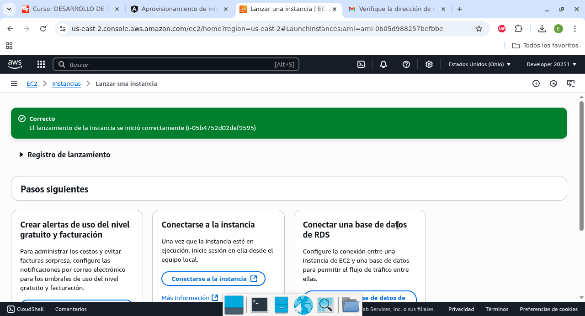
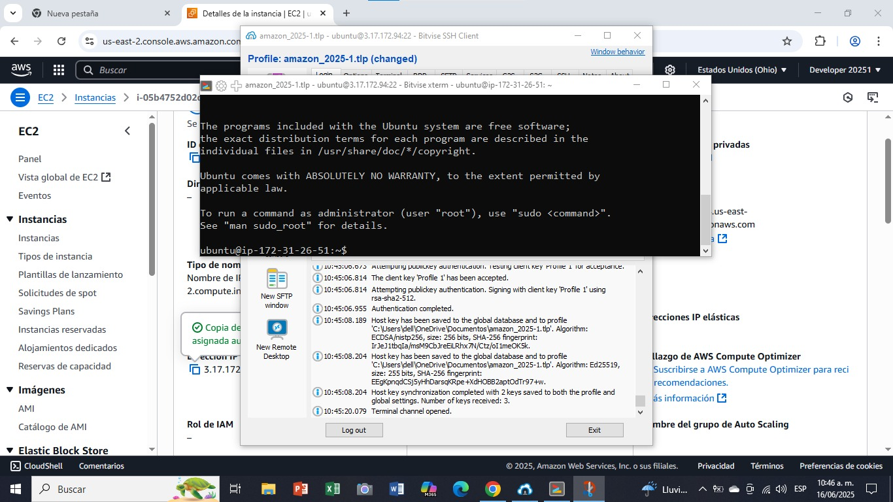
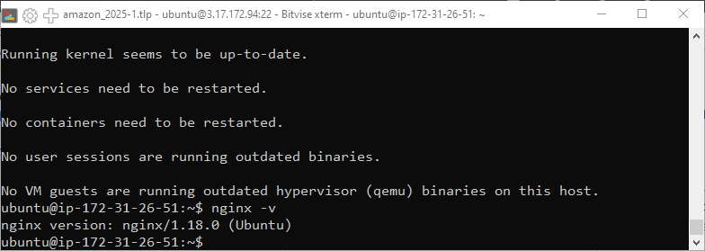
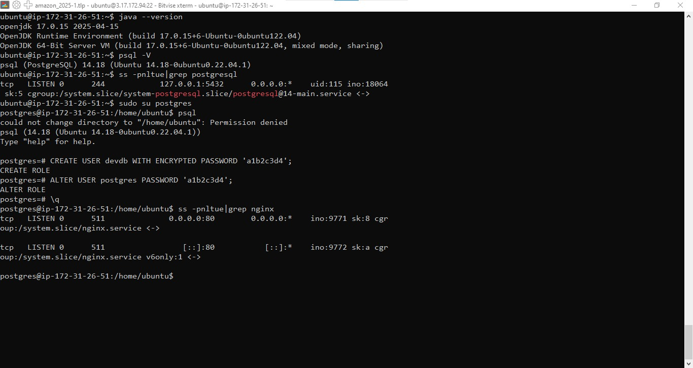
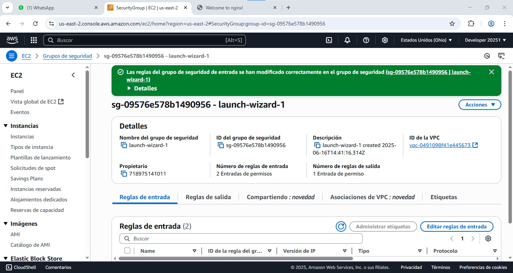
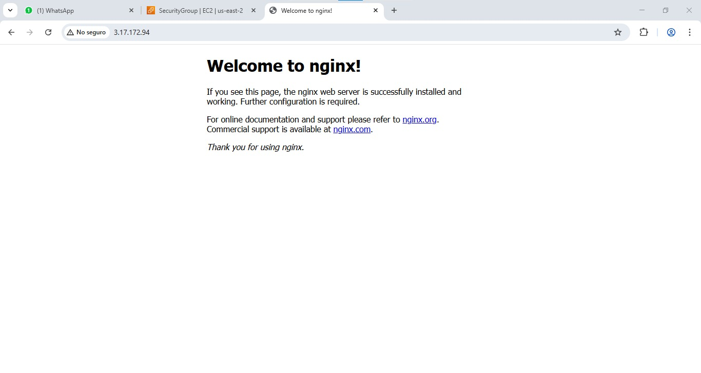
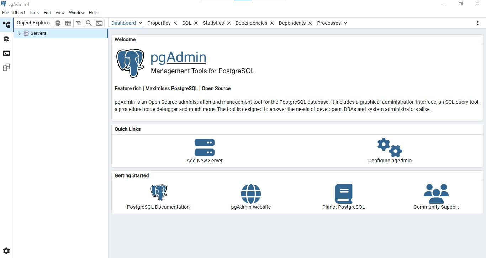
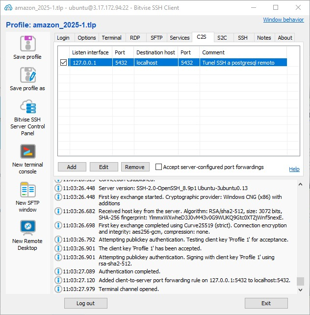
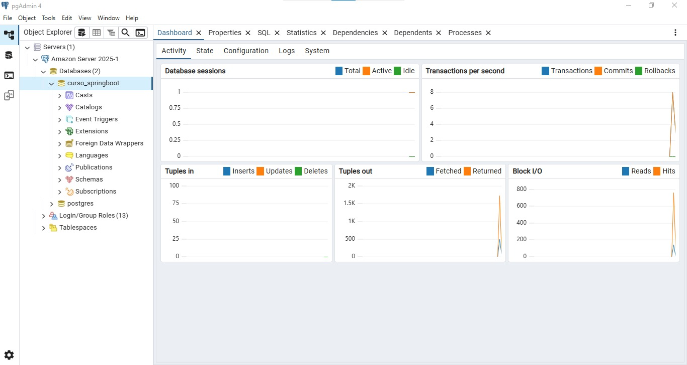
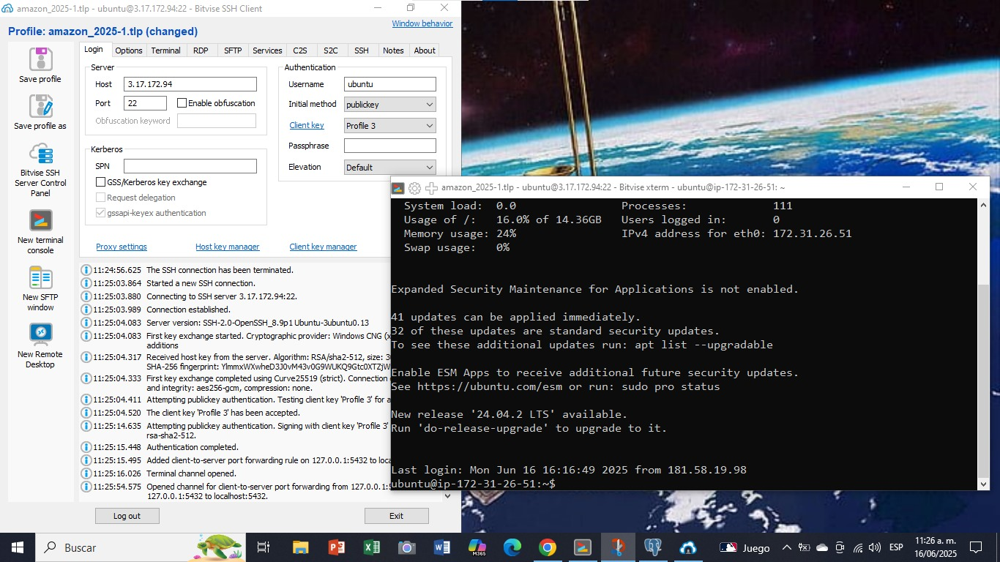

# Aprovisionamiento de instancias de computo

## 1. Creacion de una instancia EC2 en el Free Tier

## 2. Conectandose a la instancia con SSH

## 3. Instalando NGINX

## 4. Instalando Java y Postgresql

## 5. Apertura del puerto web (80) en la consola de EC2

## 6. Instalando pgadmin

## 7. Creacion de un tunel C2S para pgadmin

## 8. Configurando pgadmin con postgresql

## 9. Creando un par de llaves RSA con passphrase

