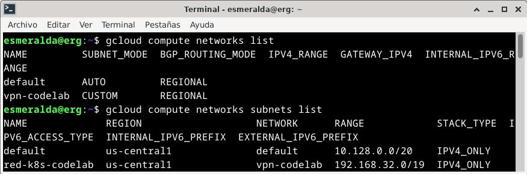
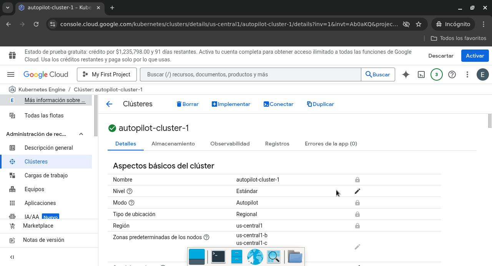
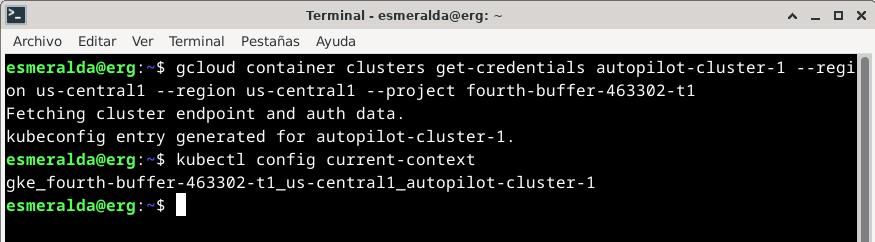
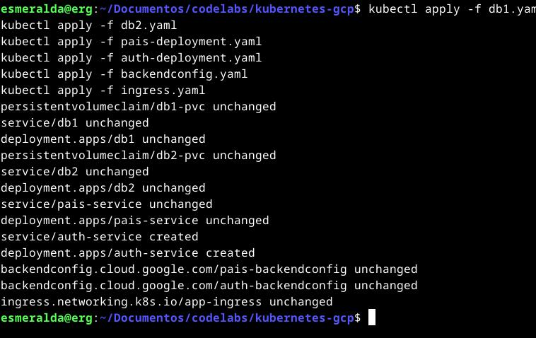
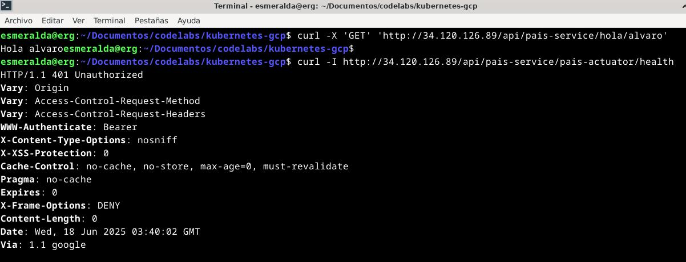

# Pruebas del despliegue

## 1. Creación de la red y subred virtual

## 2. Despliegue del clúster

## 3. Conexión al clúster

## 4. Despliegue del backend

## 5. Pruebas
## IP
### 1. /hola/alvaro
[34.120.126.89](http://34.120.126.89/api/pais-service/hola/alvaro)
### 2. /pais-actuator/health
[34.120.126.89](http://34.120.126.89/api/pais-service/pais-actuator/health)
## Error
El comando `curl -I http://34.120.126.89/api/pais-service/pais-actuator/health` devuelve `401 Unauthorized` porque Spring Security protege el endpoint `/pais-actuator/health`. En `auth-service`, el pod está `0/1 READY` y el backend está `UNHEALTHY` debido a que el `readinessProbe` falla.

Sin acceso al código fuente de las imágenes `alvarosalazar/pais-service:latest` y `alvarosalazar/auth-service:latest`, no se logra modificar la configuración de Spring Security para excluir `/actuator/**` de la autenticación, lo que impide que los health checks funcionen correctamente.

